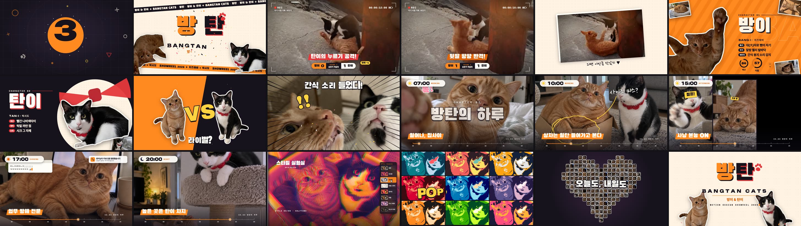
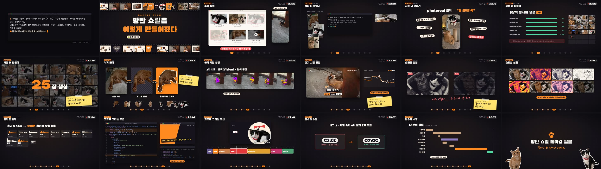

# 방탄 — 방이 & 탄이 모션그래픽 쇼릴

치즈태비 방이와 턱시도 탄이의 사진 3장과 아기 시절 영상 12초로 만든 1분짜리 한글 모션그래픽 쇼릴입니다. 제작 과정을 담은 메이킹 필름도 함께 들어 있습니다.

## 결과물

| 파일 | 길이 | 크기 | 설명 |
|---|---|---|---|
| `방탄_쇼릴_2026.mp4` | 1:00 | 147MB | 쇼릴 원본 화질 (1920×1080, 30fps) |
| `방탄_쇼릴_2026_공유용.mp4` | 1:00 | 54MB | 쇼릴 공유용 압축본 |
| `방탄_메이킹필름.mp4` | 1:39 | 93MB | 메이킹 필름 원본 화질 |
| `방탄_메이킹필름_공유용.mp4` | 1:39 | 40MB | 메이킹 필름 공유용 압축본 |

영상 파일은 Git LFS로 올라가 있습니다. 클론할 때 `git lfs install`이 먼저 되어 있어야 실제 영상이 받아집니다.

### 쇼릴



인트로 카운트다운 → "방" "탄" 타이틀 → 아기 시절 레슬링 중계(고양이 위치 추적) → 캐릭터 소개 → 방탄의 하루(12컷) → 스타일 실험실(화풍 8종) → 하트 모자이크와 엔드 카드 순서로, 120BPM 박자에 맞춰 컷이 바뀝니다.

### 메이킹 필름



22:23 소재 도착부터 23:11 완성까지 48분의 실제 작업 기록(파일 시각, 실패 사례, 수정 전후 컷)을 8단계로 정리했습니다.

## 폴더 구조

```text
bangtan-cat/
├── KakaoTalk_*.jpeg, KakaoTalk_*.mp4   원본 사진·영상 (사진 2장은 중복본)
├── refs/                              이미지 생성용 참조 사진 (축소본)
├── generated/                         AI로 생성한 사진 25장
│   ├── jobs.txt                       장면별 프롬프트
│   ├── gen_one.sh, run_all.sh         codex 병렬 생성 스크립트
│   └── .logs/                         생성 로그
├── docs/                              README 미리보기 이미지
└── showreel/                          Remotion 프로젝트
    ├── src/
    │   ├── scenes/                    쇼릴 장면 7개
    │   ├── making/                    메이킹 필름 장면
    │   ├── components/                키네틱 타이포·이펙트·미디어 컴포넌트
    │   └── lib/                       타이밍(BPM)·색·폰트·프레임 유틸, 고양이 추적 데이터
    ├── tools/                         누끼·추적(Swift), 전처리·음악 합성·믹스(Python), 스틸 렌더(Node)
    └── public/                        폰트, 이미지, 스티커, 스타일 변형, 영상, 음악·효과음
```

## 다시 만들기

macOS, Node.js 22, Python 3(numpy, scipy, opencv, Pillow), ffmpeg가 필요합니다.

```bash
cd showreel
npm install

# 미리보기
npx remotion studio src/index.ts

# 쇼릴: 음악 합성 → 효과음 믹스 → 무음 렌더 → 합치기
python3 tools/music.py
python3 tools/mix.py
npx remotion render src/index.ts Showreel out/video_final.mp4 --muted --crf=15
ffmpeg -i out/video_final.mp4 -i out/mix.wav -map 0:v -map 1:a -c:v copy -c:a aac -b:a 320k -shortest ../방탄_쇼릴_2026.mp4

# 메이킹 필름 (쇼릴 믹스 out/mix.wav 가 먼저 있어야 함)
python3 tools/making_music.py
python3 tools/making_mix.py
npx remotion render src/index.ts Making out/making_video.mp4 --muted --crf=16
ffmpeg -i out/making_video.mp4 -i out/making_mix.wav -map 0:v -map 1:a -c:v copy -c:a aac -b:a 320k -shortest ../방탄_메이킹필름.mp4
```

`tools/prep.py`와 `tools/making_prep.py`는 작업 당시 경로를 기준으로 소재를 만든 스크립트입니다. 결과물은 이미 `showreel/public/`에 들어 있으니 다시 실행하지 않아도 됩니다.

## 제작 방식

- **사진 생성**: codex-image로 5장씩 병렬 생성했습니다. 실제 사진을 참조 이미지로 넣어 털 무늬와 빨간 뜨개 나비넥타이를 유지했고, photoreal 원칙(폰 스냅 질감, 자연광, 글자 없는 소품)으로 프롬프트를 썼습니다.
- **누끼**: macOS Vision의 피사체 분리로 고양이만 오려 흰 외곽선 스티커로 만들었습니다.
- **영상 추적**: Vision 마스크 안에서 주황 털과 검은 털의 중심을 따로 구해, 아기 고양이 두 마리의 위치를 240프레임 동안 추적했습니다.
- **음악·효과음**: 외부 샘플 없이 numpy/scipy로 합성했습니다.
- **모션**: Remotion(React)으로 모든 애니메이션을 코드로 작성했습니다.

`generated/`의 사진 25장은 AI가 만든 이미지입니다. 실제 촬영한 사진은 `KakaoTalk_*.jpeg` 3장과 영상 1개뿐입니다.
